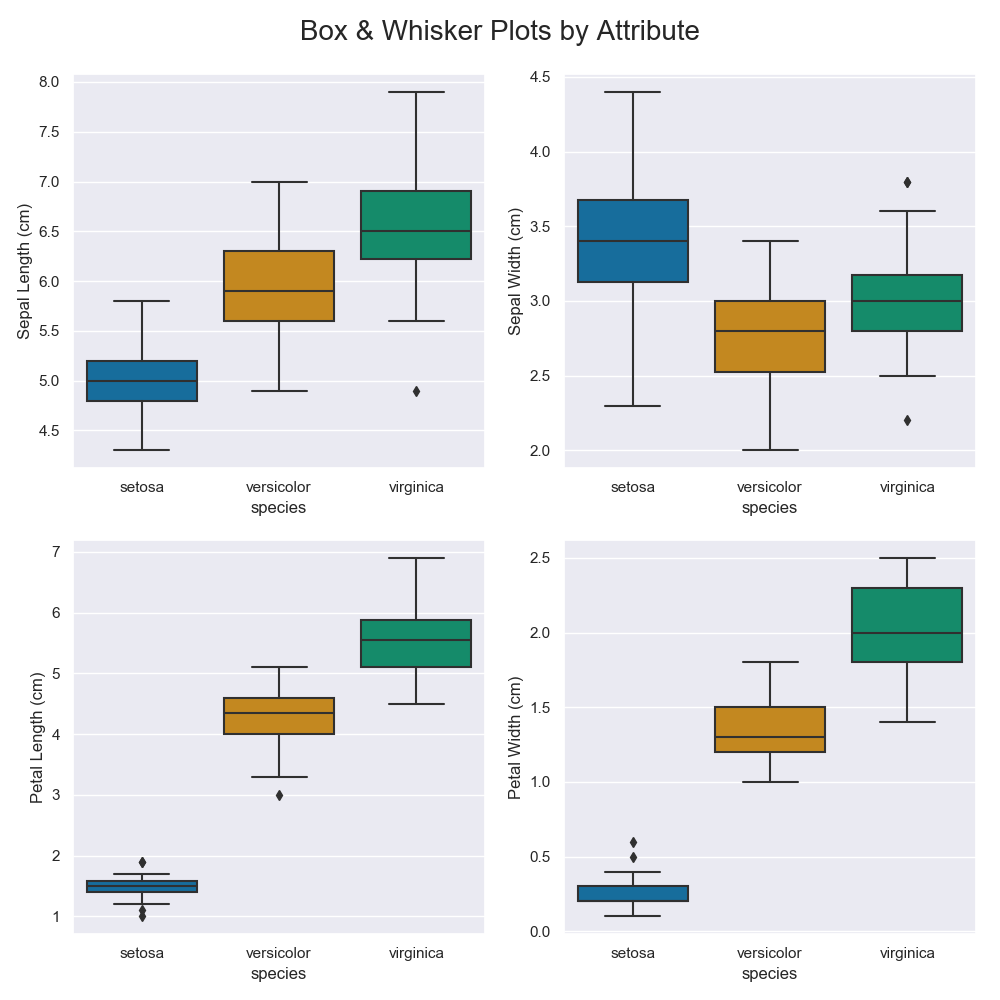
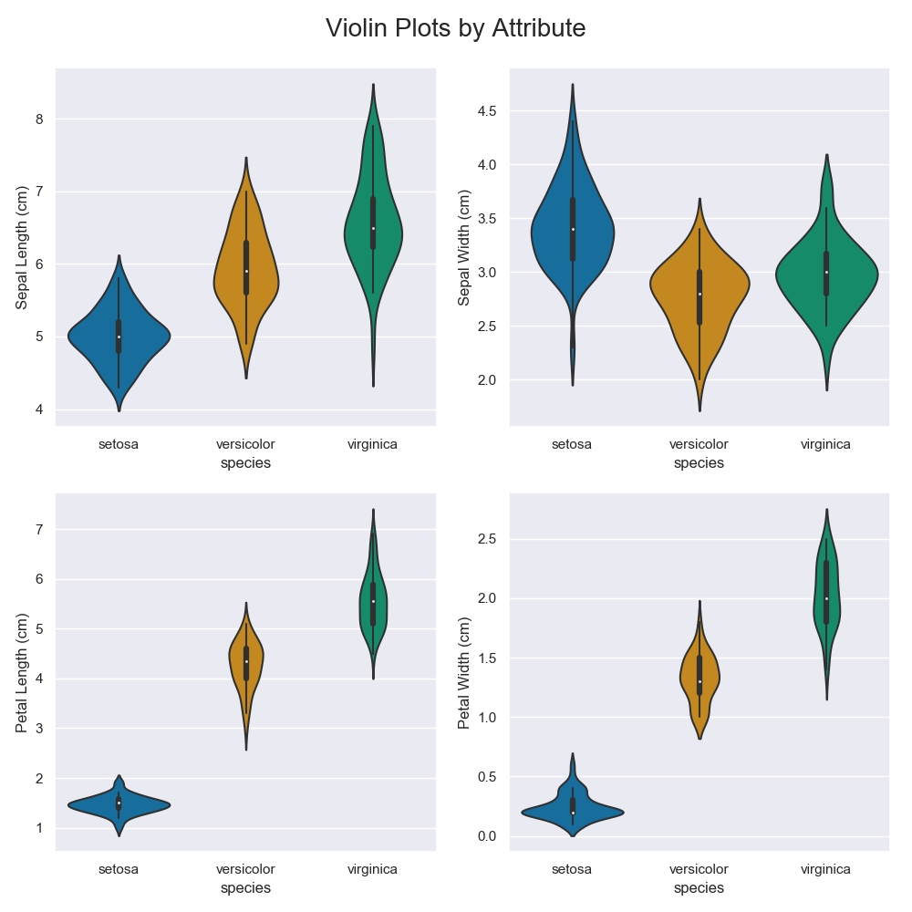
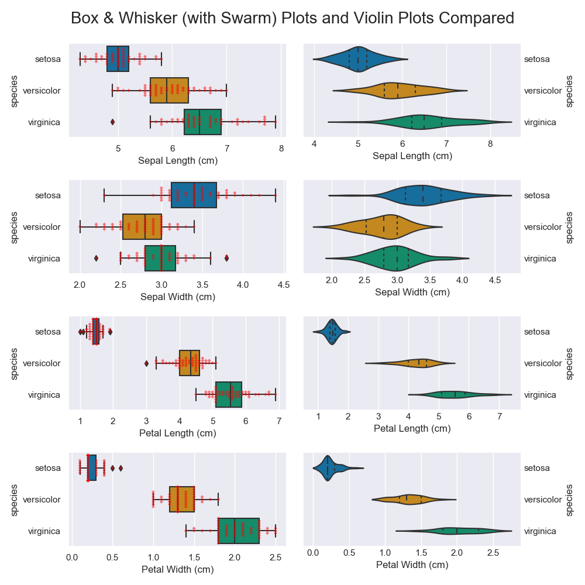
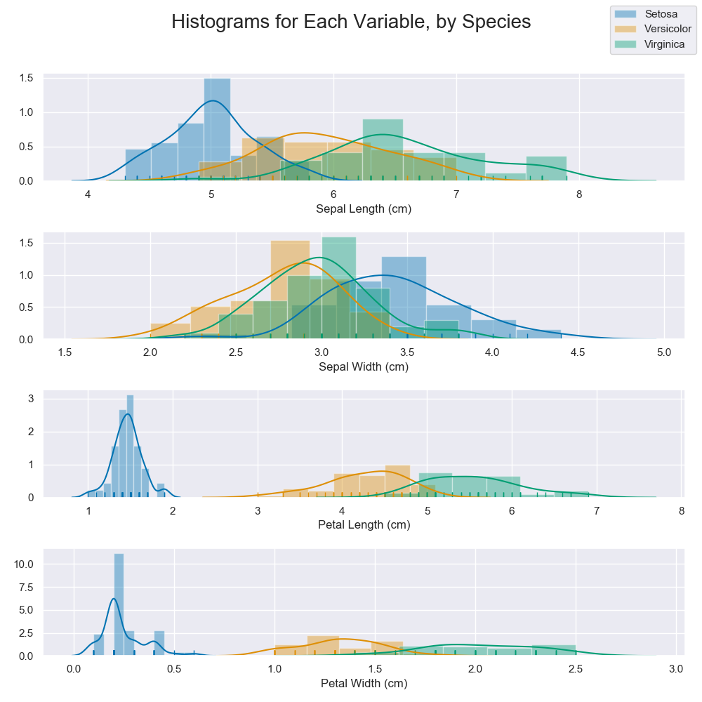
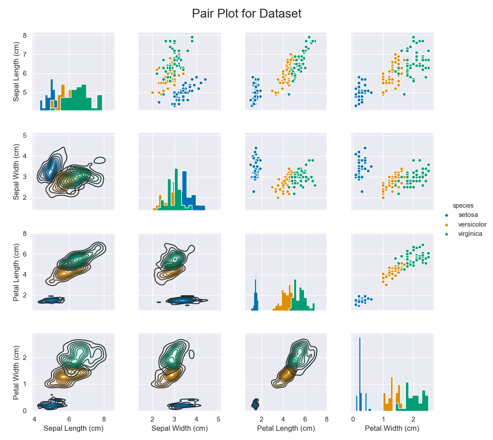

# Programming and Scripting 2019 Project
## G00190832 Peter McGowan

## Table of Contents
<!-- TOC -->
- [Introduction](#introduction)
    - [Background](#Background)
    - [Machine Learning](#Machine-Learning)
    - [Literature Review and Interesting Previous Analyses](#Literature-Review-and-Interesting-Previous-Analyses)
    - [Issues and Inconsistencies with Dataset](#Issues-and-Inconsistencies-with-Dataset)
- [License](#License)
- [Python Programmes](#Python-Programmes)
    - [Downloading the Repository](#Downloading-the-Repository)
    - [How to Run](#How-to-Run)
    - [Libraries Used](#Libraries-Used)
    - [Implementation](#Implementation)
    - [Investigations and Analysis](#Investigations-and-Analysis)
- [Results](#Results)
    - [Data and Tables Output](#Data-and-Tables-Output)
    - [Plots](#Plots)
- [Conclusions](#Conclusions)   
- [References](#References)
<!-- /TOC -->  

## Introduction

This analysis of Fisher's Iris Flower Data Set has been carried out as an assignment of the Programming & Scripting module of the Higher Diploma In Data Analytics at GMIT. The project description can be found [here](https://github.com/ianmcloughlin/project-pands/blob/master/project.pdf).

The project repository contains the following files:

File | Description
-----| -----------
LICENSE | License for project (Apache 2.0)
README.md | This file - description of project and instructions
iris.csv | Iris Flower Data Set
iris_analysis.py | Python Programme for carrying out analysis of Iris Dataset
iris_visualisation.py | Python Programme for creating visualisations from Iris Dataset
iris_boxplot.png | Output from iris_visualisation.py - Box & Whisker Plot
iris_violin.png | Output from iris_visualisation.py - Violin Plot
iris_box_violin.png | Output from iris_visualisation.py - Comparison of Box & Whisker Plot and Violin Plot
iris_dist.png | Output from iris_visualisation.py - Histogram
iris_pairgrid.png |  Output from iris_visualisation.py - Pairgrid Plot

### Background

The data analysed by this programme is the "Iris Flower Data Set"<sup>[1](#myfootnote1)</sup>. R.A. Fisher collated and presented the data set in 1936 in his paper "The Use of Multiple Measurements in Taxonomic Problems"<sup>[2](#myfootnote2)</sup>. In this paper he studied the use of linear combinations of multiple characterising features of a species to discriminate it from related species. Fisher studied three related species of iris flowers in this paper:

- Iris setosa
- Iris versicolor
- Iris virginica

Fifty samples of each species were analysed, with the data for Iris setosa and Iris versicolor having been provided by his then-colleague, Botanist Edgar Anderson, from a study of a single colony.

Fisher studied four characteristics of each species:

- Sepal Length
- Sepal Width
- Petal Length
- Petal Width

### Machine Learning

Emerj.com defines "machine learning" as:
>[T]he science of getting computers to learn and act like humans do, and improve their learning over time in autonomous fashion, by feeding them data and information in the form of observations and real-world interactions.<sup>[3](#myfootnote3)</sup>

In the context of this project, we can state that machine learning involves the development of algorithms that can allow software to be trained (using training data) to recognise and classify data from real-world sources.

The data set has several characteristics that render it useful for machine learning applications, including but limited to the following:

- The Iris-setosa class is linearly separable from the other classes
- The Iris-versicolor and Iris-virginica classes are not linearly separable from each other
- It contains only 150 rows and 5 columns, therefore processing time for algorithms is relatively small
- The data set is made up of real data, made from careful observations by an expert - it has not been synthesised and can therefore be considered a fair representation of the real world

Linear separability is an interesting in relation to the dataset, as the setosa observations can be easily distinguished from the versicolor and virginica observations<sup>[4](#myfootnote4)</sup>.

### Literature Review and Interesting Previous Analyses

A great many examples of analysis using the Iris Flower Data Set can be found online. Implementations in Python using various libraries are common, as are examples using other software packages.

#### Exploring the Iris Dataset - The Data Salaryman

"The data salaryman" presents an investigation into the data set using R (with the [tidyverse package](https://www.tidyverse.org/)) on Medium<sup>[5](#myfootnote5)</sup>. In addition to discussing the background and useful characteristics of the data set, he presents some basic visualisations (box & whisker plot and scatter plot) and then delves into three different algorithms for automated classification of data based on petal length and petal width:

- Decision Trees (~93% accuracy): Involves development of rules to cleanly divide data;
- Nearest Neighbour Clustering (>95% accuracy): Clustering of data based on training data;
- Support Vector Classsification (>95% accuracy): Clustering of data based on training data.

In keeping with the known characteristics of the data set, all algorithms explored had difficulty in distinguishing between the versicolor and virginica datasets in some incidences.

#### Basic Analysis of the Iris Data set Using Python - Oluwasogo Oluwafemi Ogundowole

Oluwasogo Oluwafemi Ogundowole demonstrates the use of pandas for management of the iris data set on Medium<sup>[6](#myfootnote6)</sup> and explores the tools of the [scikit-learn package](https://scikit-learn.org/stable/) (sklearn). He provides some basic viaualisations using matplotlib also.

The approach taken is to compare the following algorithms for machine learning:

- Logistic Regression (LR)
- Linear Discriminant Analysis (LDA)
- K-Nearest Neighbors (KNN)
- Classification and Regression Trees (CART)
- Gaussian Naive Bayes (NB)
- Support Vector Machines (SVM)

The findings were that the KNN algorithm was most accurate for making predictions, with an accuracy of ~90%. As expected, the setosa class is discriminated from the others 100% of the time.

#### Seaborn plot to visualize Iris data - Rakesh Kumar

Rakesh Kumar's python notebook on Kaggle<sup>[7](#myfootnote7)</sup> explores the use of the Seaborn library for python in visualising the data set.

He presents a range of seaborn plots to highlight characteristics of the data and has provided some inspiration for the visualisations used in this project.

#### Machine Learning with Iris Dataset - Jane Chen

Jane Chen on Kaggle<sup>[8](#myfootnote8)</sup> combines pandas, seaborn and sklearn in visualisation and analysis of the data set. She presents a pairplot and violin plots which demonstrate the characteristics of the data set. Following this she carries out classification of the data using the KNN algorithm. She presents two alternatives for selecetion of a training dataset and a testing dataset:

1. Train and test on the same dataset: 
    - Not preferred as it doesn't fit with the end goal of predicting previously unseen data
2. Split the dataset into a training set and a testing set:
    - Real observations will be used for both testing and training of the algorithm
    - No observations will appear in both datasets
    - Accuracy scores can vary depending on data selected

The article further explores the effect of the complexity (k value) used in the KNN algorithm.

### Issues and Inconsistencies with Dataset

It is noted that there are three inconsistencies between the data set sourced from  UCI<sup>[1](#myfootnote1)</sup> and the data set presented by Fisher<sup>[2](#myfootnote2)</sup>

1. 35th sample: the fourth feature is given as "0.1" where Fisher had originally given "0.2".
2. 38th sample: the second feature is given as "3.1" where Fisher had originally given "3.6".
3. 38th sample: the third feature is given as "1.5" where Fisher had originally given "1.4".

These three errors have not been rectified in the data set analysed.

## License

This project is licensed under the Apache License 2.0 - see [LICENSE.md](LICENSE) for details.

## Python Programmes

### Downloading the Repository

The repository is stored at [https://github.com/Pmcg1/PandS_Project_2019](https://github.com/Pmcg1/PandS_Project_2019).

To download it, do the following:

1. Click on the "Clone or Download" button
2. Select "Download ZIP". This will open a prompt allowing you to save the file to your computer.
3. Navigate to the download location and extract the compressed (.zip) folder to a suitable location.

### How to Run

Once you have downloaded the folder, you will need to ensure that you are running it in the correct environment. This software has been written using Python 3.7.1, it will require a Python version of 3.7 at a minimum to run as designed. This project also requires a number of external Python libraries ([listed below](#Libraries-Used)).
I recommend that you download the Anaconda distribution of Python 3.7 from the [downloads section](https://www.anaconda.com/distribution/#download-section) of the Anaconda Website.

Once the correct version of Python has been installed, running either of the included programmes can be carried out as follows:

1. Open a command prompt (cmd) or equivalent on your PC. The alternative "cmder" programme ([available here](https://cmder.net/)) is recommended.
2. Navigate to the drive that the programme is on by typing the drive letter followed by :.
3. Navigate to the correct folder using the "cd" command.
4. Run the programme by typing the following:

> python <programme_name.py>

### Libraries Used

- [Numpy](https://www.numpy.org/) - Used for a number of mathematical functions in the [iris_analysis.py](iris_analysis.py) programme;
- [Scipy](https://www.scipy.org/) - Used for certain statistical analysis functions in the [iris_analysis.py](iris_analysis.py) programme;
- [Pandas](https://pandas.pydata.org/) - Used for import, management, analysis and manipulation of data in the [iris_analysis.py](iris_analysis.py) and the [iris_visualisation.py](iris_visualisation.py) programme;
- [Matplotlib.pyplot](https://matplotlib.org/tutorials/introductory/pyplot.html) - Used for manipulation of elements of certain plots in the [iris_visualisation.py](iris_visualisation.py) programme;
- [Seaborn](https://seaborn.pydata.org/) - Used for creation and manipulation of all plots in the [iris_visualisation.py](iris_visualisation.py) programme. Seaborn extends the functionality of Matplotlib.

Please note that the programmes will not run successfuly if their required libraries are not installed.

## Implementation and Results

Two separate python programmes have been written for this project:

- [iris_analysis.py](iris_analysis.py): This is for carrying out general and statistical analysis of the data. It outputs results to the command line.
- [iris_visualisation.py](iris_visualisation.py): This is for creation of visualisations of the data set. It outputs plots to the folder the programme is stored in.

### Data and Tables Output

Code samples are included in the following sections and explained. For clarity, comments have been removed, but these can be viewed in the included python programmes.

This section referes primarily to the programme [iris_analysis.py](iris_analysis.py).

#### General Analysis

##### Data Import and Preparation

Pandas is used to import the data from csv (pandas.read_csv), and then convert it to a dataframe.

This is implemented as follows:

``` Python
f = pd.read_csv('iris.csv')
df = pd.DataFrame(f)
```

This code is reused in the [iris_visualisation.py](iris_visualisation.py) programme.

##### Unique Species

The following python code is used to extract unique species from the dataset and print them iteratively: 

``` Python
speciesList = df['species'].unique()
print('Species included in this dataset are: ')
for i in speciesList:
    print ('* ', i)
print()
```

This generates the following output:

```
Species included in this dataset are:
*  setosa
*  versicolor
*  virginica
```

##### Dataset Info

Pandas dataframe.info command is used to output selected information about the structure of the dataset.

``` Python
print('Information about the imported dataset: ')
print(df.info(verbose=True, memory_usage=False, null_counts=False),'\n')
```

Output:
```
Information about the imported dataset:

<class 'pandas.core.frame.DataFrame'>|_
------------|---------------
RangeIndex: | 150 entries, 0 to 149
Data columns | (total 5 columns):
sepal_length |   float64
sepal_width  |   float64
petal_length |   float64
petal_width  |   float64
species      |   object
dtypes: | float64(4), object(1)None
```

##### Records for Each Species

Pandas series.value_counts command is used to output the number of records relating to each species.

``` Python
print('Records for each species:')
print(df['species'].value_counts(),'\n')
```

Output:

```
Records for each species:|_
-----------|-----
virginica  |  50
versicolor |   50
setosa     |   50
Name: species, dtype: int64
```

##### Sample of Data (Head)

Two examples of sampling the data and presenting it to the user are used. The first example uses pandas dataframe.head with the count set to 5, to output the first five records in the dataframe.

``` Python
print('Sample of data (First 5 records):')
print(df.head(n=5),'\n')
```

Output table:

```
Sample of data (First 5 records):

_   | sepal_length | sepal_width | petal_length | petal_width | species
--- | :----------: | :---------: | :----------: | :---------: | -------:
0   |     5.1      |     3.5     |     1.4      |     0.2     | setosa
1   |     4.9      |     3.0     |     1.4      |     0.2     | setosa
2   |     4.7      |     3.2     |     1.3      |     0.2     | setosa
3   |     4.6      |     3.1     |     1.5      |     0.2     | setosa
4   |     5.0      |     3.6     |     1.4      |     0.2     | setosa
```

##### Sample of Data (Random)

Similarly to the previous section, pandas dataframe.sample is used to out a random five records from the dataframe.

``` Python
print('Sample of data (Random 5 records):')
print(df.sample(n=5),'\n')
```

Output table:

```
Sample of data (Random 5 records):

_   | sepal_length | sepal_width | petal_length | petal_width | species
--- | :----------: | :---------: | :----------: | :---------: | -------:
129 |     7.2      |     3.0     |     5.8      |     1.6     | virginica
74  |     6.4      |     2.9     |     4.3      |     1.3     | versicolor
126 |     6.2      |     2.8     |     4.8      |     1.8     | virginica
127 |     6.1      |     3.0     |     4.9      |     1.8     | virginica
2   |     4.7      |     3.2     |     1.3      |     0.2     | setosa
```

#### Statistical Analysis

##### Statistics for Entire Dataset

Pandas dataframe.describe function is used to extract some basic summary statistics from the dataframe and display to the screen.

``` Python
print("Summary statistics for the dataset:")
print(round(df.describe(percentiles=[]),3),'\n')
```

This outputs the following table:

```
Summary statistics for the dataset

_           | sepal_length | sepal_width | petal_length | petal_width
----------- | :----------: | :---------: | :----------: | :---------:
count       |   150.000    |   150.000   |   150.000    |   150.000
mean        |     5.843    |     3.054   |     3.759    |     1.199
std         |     0.828    |     0.434   |     1.764    |     0.763
min         |     4.300    |     2.000   |     1.000    |     0.100
50%         |     5.800    |     3.000   |     4.350    |     1.300
max         |     7.900    |     4.400   |     6.900    |     2.500
```

##### Statistics for Each Species

In order to extract more detailed statistics from the dataframe it was necessary to write a more complex function (speciesStats). This iterates through the sepal_length, sepal_width, petal_length and petal_width columns and applies a number of Numpy and Scipy functions to extract statistics:

- Minimum (min): numpy.min is applied to the column to select the lowest value
- Maximum (max): numpy.max is applied to the column to select the highest value
- Median: numpy.median is applied to the column to select the middle value
- Average (mean): numpy.mean is applied to the column to calculate the average, this is returned rounded to 3 decimal places
- Variance (var): numpy.var is applied to the column to calculate the variance (spread of the data)<sup>[9](#myfootnote9)</sup>, this is returned rounded to 3 decimal places
- Standard Deviation (StDev): numpy.std is applied to the column to calculate the standard deviation (spread around the mean)<sup>[9](#myfootnote9)</sup>, this is returned rounded to 3 decimal places
- Range: The difference between numpy.min and numpy.max gives the range of data in the column
- Skewness: scipy.stats.skew is applied to the column to calculate the skewness (measure of lack of symmetry)<sup>[10](#myfootnote10)</sup>, this is returned rounded to 3 decimal places
- Kurtosis: scipy.stats.kurtosis is applied to the column to calculate the kurtosis (measure of tailed-ness of data)<sup>[10](#myfootnote10)</sup>, this is returned rounded to 3 decimal places

The python function, as shown below, does the following:

1. Extracts the first 4 columns from the dataset provided, ignoring the last (species) column.
2. Builds an empty dataframe (statDF) with the columns generated in step 1 and using as indices the statistical functions listed above.
3. Runs through a "for loop" once for each column, created a "dict" that assigns the statistical results to the keys listed.
4. Updates the statDF dataframe with the relevant values for the column.
5. Prints the dataframe contents.

```Python
def speciesStats(species): 
   print(f'Detailed statistical analysis for species: {species.iloc[0,4]}')
   measColumns = species.columns[0:4]
   statDF = pd.DataFrame(data = None, columns = measColumns, index = ['Min', 'Max', 'Median', 'Mean', 'Variance', 'StDev', 'Range', 'Skewness', 'Kurtosis']) 

   for i in measColumns:
      column = species.loc[:,i]
      columnDict =	{ 
         "Min": np.min(column),
         "Max": np.max(column),
         "Median": np.median(column),
         "Mean": round(np.mean(column),3),
         "Variance": round(np.var(column),3),
         "StDev": round(np.std(column),3),
         "Range": (np.max(column)-np.min(column)),
         "Skewness": round(stats.skew(column),3),
         "Kurtosis": round(stats.kurtosis(column),3)
      }
      statDF[i].update(pd.Series(columnDict))
   print(statDF, '\n')
```

Calling the function is achieved through a "for loop" that iterates through the previously generated species list.

``` Python
for i in speciesList:
   speciesDF = df.query("species == @i")
   speciesStats(speciesDF)
```

The three output tables are as follows:

```
Detailed statistical analysis for species: setosa

_           | sepal_length | sepal_width | petal_length | petal_width
----------- | :----------: | :---------: | :----------: | :---------:
Min         |      4.3     |     2.3     |        1     |     0.1  
Max         |      5.8     |     4.4     |      1.9     |     0.6  
Median      |        5     |     3.4     |      1.5     |     0.2  
Mean        |    5.006     |   3.418     |    1.464     |   0.244  
Variance    |    0.122     |   0.142     |     0.03     |   0.011  
StDev       |    0.349     |   0.377     |    0.172     |   0.106  
Range       |      1.5     |     2.1     |      0.9     |     0.5  
Skewness    |    0.116     |   0.104     |     0.07     |   1.161  
Kurtosis    |   -0.346     |   0.685     |    0.814     |   1.296  
```

```
Detailed statistical analysis for species: versicolor

_           | sepal_length | sepal_width | petal_length | petal_width
----------- | :----------: | :---------: | :----------: | :---------:
Min         |      4.9     |       2     |        3     |       1  
Max         |        7     |     3.4     |      5.1     |     1.8  
Median      |      5.9     |     2.8     |     4.35     |     1.3  
Mean        |    5.936     |    2.77     |     4.26     |   1.326  
Variance    |    0.261     |   0.097     |    0.216     |   0.038  
StDev       |    0.511     |   0.311     |    0.465     |   0.196  
Range       |      2.1     |     1.4     |      2.1     |     0.8  
Skewness    |    0.102     |  -0.352     |   -0.588     |   -0.03  
Kurtosis    |   -0.599     |  -0.448     |   -0.074     |  -0.488  
```

```
Detailed statistical analysis for species: virginica  

_           | sepal_length | sepal_width | petal_length | petal_width
----------- | :----------: | :---------: | :----------: | :---------:
Min         |      4.9     |     2.2     |      4.5     |     1.4
Max         |      7.9     |     3.8     |      6.9     |     2.5  
Median      |      6.5     |       3     |     5.55     |       2  
Mean        |    6.588     |   2.974     |    5.552     |   2.026  
Variance    |    0.396     |   0.102     |    0.298     |   0.074  
StDev       |    0.629     |   0.319     |    0.546     |   0.272  
Range       |        3     |     1.6     |      2.4     |     1.1  
Skewness    |    0.114     |   0.355     |    0.533     |  -0.126  
Kurtosis    |   -0.088     |    0.52     |   -0.256     |  -0.661  
```

### Plots

This section referes primarily to the programme [iris_visualisation.py](iris_visualisation.py).

All plots are saved to the folder that this programme is stored in, in .png format. Please take care when generating plots as any existing plots in the folder will be overwritten.

To avoid repetition and hard-coding, all plots are generated via "for loop"s.

#### Data Preparation

The data is imported to the programme in the same manner as [iris_analysis.py](iris_analysis.py).

Following this a number of perparatory steps are taken:

1. Three dataframes are created as subsets of the overall dataframe, one for each species:

``` Python
setosaSet = df.query("species == 'setosa'")
versiSet = df.query("species == 'versicolor'")
virgiSet = df.query("species == 'virginica'")
```

2. Three variables are generated for use throughout the programme:

- dfCols: A list of the columns in the dataframe df excluding the species columns
- n: The number of columns in dfCols (4)
- dfLabels: A list of axis titles for graphs including units to replace the column headings

``` Python
dfCols = list(df.iloc[:, :-1])
n=len(dfCols)
dfLabels = ["Sepal Length (cm)", "Sepal Width (cm)", "Petal Length (cm)", "Petal Width (cm)"]
```

3. Global styles are set for Seaborn plots:

``` Python
sns.set(style='darkgrid')
sns.set_palette("colorblind",3)
```

#### Box & Whisker Plots

Box & Whisker plots display a "five number summary" of data as follows:

- Upper quartile and lower quartile are represented by the top and bottom of the filled box
- Median is shown by a horizontal line through the filled box
- Lower and upper extremes are displayed as perpendicular lines at the end of the "whiskers" protruding from the box

Additionally, outliers (if present) can be shown by points beyond the extreme value lines.

The limitation of this type of plot is that it does not show the Kernal Density Estimate (KDE)<sup>[11](#myfootnote11)</sup> of observations.

This is generated via an "axes-level" plot in Seaborn. The format is 2x2 to display each variable in a square grid.
A "for loop" cycles through the axes (explicitly declared), creates a boxplot for the variable and labels it appropriately from the dfLabels list. An object-oriented approach "g = " is used in creation of each boxplot for ease of use in attaching labels.

Presentation is completed via the plt.tight_layout command, a title is added and the plot is saved to the folder.

``` Python
fig, axes = plt.subplots(2, 2, figsize=(10, 10))

i=0
ax00 = axes[0][0]
ax01 = axes[0][1]
ax10 = axes[1][0]
ax11 = axes[1][1]

for ax in [ax00, ax01, ax10, ax11]:

    g = sns.boxplot(x="species", y=dfCols[i], data=df, ax=ax)
    g.set_ylabel(dfLabels[i])
    i+=1

plt.tight_layout(rect=[0, 0, 1, 0.95])
plt.suptitle("Box & Whisker Plots by Attribute", fontsize = 20)
plt.savefig("iris_boxplot.png")
```

The plots generated are shown below:



The plots shown above are separated by species. It can clearly be seen that there is little or no overlap between measurements fro setosa as compared to the other two species.

#### Violin Plots

Violin plots are similar to box & whisker plots but with the addition of showing the KDE. The elements of a violin plot are as follows:

- The outer violin shape is a mirrored KDE plot
- The mean upper and lower extremens are displayed by thin whiskers inside the violin
- The upper and lower quartile are shown as the extents of a thicker dark line
- The median is a white dot at the centre of the quartile marker line

Generation of the vioolin plots is carried out almost identically to that of the boxplots, with the sns.violinplot command replacing the sns.boxplot command.

``` Python
fig, axes = plt.subplots(2, 2, figsize=(10, 10))

i=0
ax00 = axes[0][0]
ax01 = axes[0][1]
ax10 = axes[1][0]
ax11 = axes[1][1]

for ax in [ax00, ax01, ax10, ax11]:

    g = sns.violinplot(x="species", y=dfCols[i], data=df, ax=ax)
    g.set_ylabel(dfLabels[i])
    i+=1

plt.tight_layout(rect=[0, 0, 1, 0.95])
plt.suptitle("Violin Plots by Attribute", fontsize = 20)
plt.savefig("iris_violin.png")
```

The plots generated are shown below:



The violin plot is a slightly more complex concept than a box & whisker plot to understand, however it has the obvious advantage of displaying all of the same data as well as the KDE.

#### Box & Whisker Plots vs Violin Plots

This plot is a side-by-side comparison of box & whisker plots with violin plots.
The box & whisker plots have additionally been overlaid with swarm plots to enhance demonstration of the data distribution.

Similar to the previous plots, an "axes-level" Seaborn plot is used to created the plots. The "for loop" creates two objects:

- g: holding the boxplot and swarmplot
- h: holding the violinplot

Some additional commands are used to move the axis label and tick labels fo the violin plots to the right hand side of the plot.

``` Python
fig, axes = plt.subplots(4, 2, sharex=False, sharey=False, figsize=(10, 10))

i=0

for i in range(n):

    g = sns.boxplot(y="species", x=dfCols[i], data=df, ax=axes[i, 0])
    g = sns.swarmplot(y="species", x=dfCols[i], alpha=0.5, size=3, marker="D", color="red", data=df, ax=axes[i, 0])
    h = sns.violinplot(y="species", x=dfCols[i], inner="quartile", data=df, ax=axes[i, 1])
    g.set_xlabel(dfLabels[i])
    h.set_xlabel(dfLabels[i])
    h.yaxis.set_label_position("right")
    h.tick_params(length=0)
    h.yaxis.set_ticks_position("right")

plt.tight_layout(rect=[0, 0, 1, 0.95])
plt.suptitle("Box & Whisker (with Swarm) Plots and Violin Plots Compared", fontsize = 20)
plt.savefig("iris_box_violin.png")
```

The side-by-side comparison plots generated are shown below:



Care must be taken in interpretation of the swarm plots - by design the points do not overlap. This can be compared to the violin plots' KDE which is strictly an estimate and will not always encompass all of the swarm plots' points.

The violin plots are (subjectively) aesthetically preferable to their counterparts due to the simple display of rich information.

#### Histograms

A set of histograms (by species) for each attribute is shown.
The histogram displays the frequency of each measured values appearance in the data set. These are also overlaid with a line representing a KDE plot.

This is again implemented as an "axes-level" plot in Seaborn. The distplot command provides a flexible approach to generation histograms.
The "for loop" creates an object "g" and then attahced three distplots (one per species) to it. Each also includes a "rugplot" (a one-dimensional scatterplot) and a the KDE (default behaviour). To aid labelling, each distplot is given a label, these are called to the figlegend (figure legend) created using the get_legend_handles_labels command. This analyses the distplot generated on the final iteration of the loop and extracts the labels it includes in order to build a legend for the figure as an alternative to individually adding legends to the subplots.

``` Python
fig, axes = plt.subplots(4, 1, sharex=False, sharey=False, figsize=(10, 10))

i=0

for i in range(n):
    g = sns.distplot(setosaSet[dfCols[i]], rug=True, label='Setosa', ax=axes[i])
    g = sns.distplot(versiSet[dfCols[i]], rug=True, label='Versicolor', ax=axes[i])
    g = sns.distplot(virgiSet[dfCols[i]], rug=True, label='Virginica', ax=axes[i])
    g.set_xlabel(dfLabels[i]) 

plt.tight_layout(rect=[0, 0, 1, 0.92])
plt.suptitle("Histograms for Each Variable, by Species", fontsize = 20)

handles, labels = g.get_legend_handles_labels()
plt.figlegend(handles, labels, loc=1)
plt.savefig("iris_dist.png")
```



The contrast between the setosa measurements as compared to those of the other two species can be clearly seen, particularly in relation to petal length and width.

#### Pairgrid

The previous plots examine variables in isolation. The pairgrid function has been used to visualise the relationships between each variable for a particular species. This allows much more control and modification to the plot over the simpler pairplot function.

- The upper triangle shows a scatterplot of each combination of variables
- The diagonals show a histogram (displayed as filed steps) for each variable
- The lower triangle shows a KDE plot of each combination of variables

To create the plot, a "pairgrid" is created with each species displayed distinctly. g.map_diag, g.map_lower and g.map_upper as used to map the plots listed above to the pairgrid. Some customisation of the appearance is also carried out.

Replacement of the column header labels is more complex than for the previous plots. A dict consisting of the dfLabels list contents keyed to the column headers is created (labelDict). Following this, a for loop cycles through the number of columns and replaces the default labels on the bottom row and left hand column with those in dfLabels.

A legend is added to the right hand side of the figure and it is formatted and saved similarly to the previous plots.

``` Python
g = sns.PairGrid(df, hue="species")

g = g.map_diag(plt.hist, histtype="stepfilled")
g = g.map_lower(sns.kdeplot)
g = g.map_upper(plt.scatter, edgecolor="w", s=30)

labelDict = {'sepal_length': dfLabels[0], 
        'sepal_width': dfLabels[1], 
        'petal_length': dfLabels[2], 
        'petal_width': dfLabels[3]
        }

i=0

for i in range(n):
    g.axes[3, i].set_xlabel(dfLabels[i])
    g.axes[i, 0].set_ylabel(dfLabels[i])

g = g.add_legend()
plt.tight_layout(rect=[0, 0, 0.90, 0.95])
plt.suptitle("Pair Plot for Dataset", fontsize = 20)
plt.savefig("iris_pairgrid.png")
```

Output plot:



As with the previous plots, setosa can be clearly distinguished from versicolor and virginica from each subplot. This is particularly apparent for the petal ;ength and width. Some significant overlap of the versicolor and virginica data sets can be seen, however it is clear that in many cases it would be possibly to classify new observations as the overlap is not 100%.

## Conclusions

The statistical analysis carried out is supperted and enhanced by the visualisations generated. This supports the general conclusion of the literature and previous projects studied - the Iris Flower Data Set is a suitable tool for development and training of machine learning algorithms due to its characteristics:

- The setosa class is linearly separable from the others
- The versicolor and virginica classes are not linearly separable from each other
- It is small enough to be easily provessed but large enough to provide a suitable sample size of data for training

These characteristics ensure that machine learning algorithms can efficiently be trained and tested with the data set.

## References

<a name="myfootnote1">1</a>: UCI Machine Learning Repository - Iris Data Set, http://archive.ics.uci.edu/ml/datasets/Iris  
<a name="myfootnote2">2</a>: The Use of Multiple Measurements in Taxonomic Problems, http://rcs.chemometrics.ru/Tutorials/classification/Fisher.pdf  
<a name="myfootnote3">3</a>: emerj.com, What is Machine Learning?, https://emerj.com/ai-glossary-terms/what-is-machine-learning/  
<a name="myfootnote4">4</a>: A Multithreaded Software Model for Backpropagation Neural Network Applications, 2.4.1 Linear Separability and the XOR Problem, http://www.ece.utep.edu/research/webfuzzy/docs/kk-thesis/kk-thesis-html/node19.html  
<a name="myfootnote5">5</a>: Exploring the Iris Dataset, https://medium.com/@livingwithdata/exploring-the-iris-dataset-260cc1e5cdf7  
<a name="myfootnote6">6</a>: Basic Analysis of the Iris Data set Using Python, https://medium.com/codebagng/basic-analysis-of-the-iris-data-set-using-python-2995618a6342  
<a name="myfootnote7">7</a>: Seaborn plot to visualize Iris data, https://www.kaggle.com/rakesh6184/seaborn-plot-to-visualize-iris-data  
<a name="myfootnote8">8</a>: Machine Learning with Iris Dataset, https://www.kaggle.com/jchen2186/machine-learning-with-iris-dataset  
<a name="myfootnote9">9</a>: Statistics Canada - Variance and Standard Deviation, https://www150.statcan.gc.ca/n1/edu/power-pouvoir/ch12/5214891-eng.htm  
<a name="myfootnote10">10</a>: NIST - Measures of Skewness and Kurtosis, https://www.itl.nist.gov/div898/handbook/eda/section3/eda35b.htm  
<a name="myfootnote11">11</a>: An introduction to kernel density estimation, http://www.mvstat.net/tduong/research/seminars/seminar-2001-05/  
<a name="myfootnote12">12</a>: Pandas - Getting Started in 10 minutes, https://pandas.pydata.org/pandas-docs/stable/getting_started/10min.html  
<a name="myfootnote13">13</a>: Official seaborn tutorial, https://seaborn.pydata.org/tutorial.html  
<a name="myfootnote14">14</a>: Generating Matplotlib Subplots Programmatically, https://medium.com/@rayheberer/generating-matplotlib-subplots-programmatically-cc234629b648  
<a name="myfootnote15">15</a>: 5 Reasons You Should Use a Violin Graph, https://blog.bioturing.com/2018/05/16/5-reasons-you-should-use-a-violin-graph/  
<a name="myfootnote16">16</a>: Plotting with seaborn using the matplotlib object-oriented interface, Stackoverflow, https://stackoverflow.com/questions/23969619/plotting-with-seaborn-using-the-matplotlib-object-oriented-interface  
<a name="myfootnote17">17</a>: A Guide to Pandas and Matplotlib for Data Exploration, https://towardsdatascience.com/a-guide-to-pandas-and-matplotlib-for-data-exploration-56fad95f951c  
